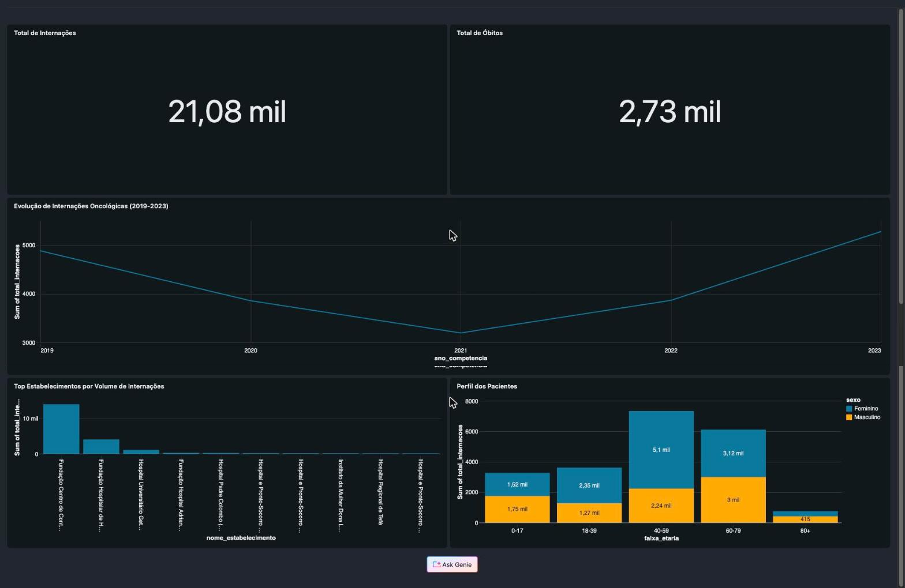

# Pipeline de Dados Oncológicos SIH-SUS — Amazonas (2019-2023)

Pipeline de engenharia de dados ponta a ponta sobre internações hospitalares por câncer (CID C00-C97) no Amazonas, construído com dados reais do DataSUS. Projeto de portfólio na minha transição de Backend (20 anos de experiência) para Engenharia de Dados.

## Por que esse dataset

Trabalhei anos próximo à FCECON (Fundação Centro de Controle de Oncologia do Amazonas), e queria um projeto de portfólio que não fosse só "mais um dataset do Kaggle". Por isso a extração é feita direto do FTP oficial do DataSUS via `pysus` — dado público real, não sintético.

## Arquitetura

```
pysus (extração local)
    │
    ▼
Arquivos brutos (SIH-SUS + CNES) → upload manual para Databricks
    │
    ▼
Databricks Free Edition (Delta Lake)
    Bronze → Silver → Gold
    (notebooks 01_bronze_to_silver, 02_silver_to_gold)

    Orquestração: Databricks Job (pipeline_sih_sus_oncologia)
    │
    ▼
Dashboard (Databricks Lakeview)
```

**Por que Databricks Free Edition:** comecei com Postgres + Airflow local, mas meu Mac de 8GB não aguentava processar escopo nacional. Migrei pra Databricks (Delta Lake + Unity Catalog) pra ter storage e processamento na nuvem sem travar a máquina.

## Modelo de dados

Star schema simples: uma fato e uma dimensão.

| Tabela | Camada | Linhas | O que é |
|---|---|---|---|
| `fato_internacoes_oncologia` | Silver | 21.076 | Internações oncológicas (CID C00-C97), AM, 2019-2023 |
| `dim_estabelecimentos_cnes` | Silver | 3.034 | Estabelecimentos de saúde do AM (cadastro CNES) |
| `gold.evolucao_temporal` | Gold | — | Internações agregadas por ano/mês/CID |
| `gold.ranking_estabelecimentos` | Gold | — | Volume, valor e permanência média por hospital |
| `gold.perfil_pacientes` | Gold | — | Perfil por sexo, raça/cor e faixa etária |

## Escopo

- **Período:** 2019-2023
- **Geografia:** Amazonas (reduzi de nacional para AM-only por limitação de tempo/processamento)
- **Diagnóstico:** CID C00-C97 (neoplasias malignas)

## Qualidade dos dados

O SIH-SUS tem lacunas reais de publicação (atraso de repasse hospitalar, correção retroativa). No meu recorte, **55 dos 60 meses esperados estão disponíveis (91,7% de completude)** — os 5 meses faltantes **não foram preenchidos com zero**, porque isso afirmaria "zero internações" quando a informação real é "dado indisponível na fonte". Detalhes completos em [`NOTAS_DADOS.md`](./NOTAS_DADOS.md).

## Dashboard



🔗 [Link do dashboard no Databricks](https://dbc-68b371cc-6a56.cloud.databricks.com/dashboardsv3/01f1be0ecfef13239c88d559dacc51f3/published?o=7474654772102544) *(requer conta no workspace Databricks — o link não tem acesso público)*

### Principais achados

- **21.076 internações** oncológicas no Amazonas entre 2019-2023, com **2.730 óbitos** registrados (taxa de ~13%)
- Queda acentuada em **2021** (provável reflexo da pandemia — leitos e recursos redirecionados para COVID), seguida de recuperação forte até 2023, superando o volume pré-pandemia
- Faixa etária **40-59 anos** concentra o maior volume de internações, com predominância feminina
- A rede de atendimento é bastante concentrada: poucos estabelecimentos (liderados pela Fundação Centro de Controle de Oncologia) respondem pela maior parte das internações do estado

## Stack

- **Extração:** Python, [pysus](https://github.com/AlertaDengue/PySUS)
- **Processamento:** PySpark / Spark SQL (Databricks)
- **Storage:** Delta Lake, Unity Catalog
- **Orquestração:** Databricks Jobs (Workflows)
- **Visualização:** Databricks Lakeview Dashboard

## Estrutura do repositório

```
├── extract/              # scripts de extração via pysus
├── NOTAS_DADOS.md         # decisões de qualidade e completude dos dados
├── docs/
│   └── dashboard.png      # print do dashboard final
└── README.md
```

Os notebooks Bronze→Silver→Gold (`01_bronze_to_silver`, `02_silver_to_gold`) rodam no workspace Databricks — não estão neste repositório porque dependem do Unity Catalog do workspace para executar.

## Próximos passos

- [ ] Investigar e documentar os CNES sem correspondência na dimensão (hospitais fora do cadastro atual)
- [ ] Avaliar expansão de escopo para outros estados, se o tempo permitir
- [ ] Testar replicação da arquitetura em Snowflake/AWS como exercício de portabilidade

---

Projeto de portfólio — [Viktor Rocha](https://github.com/Viktoorrocha)